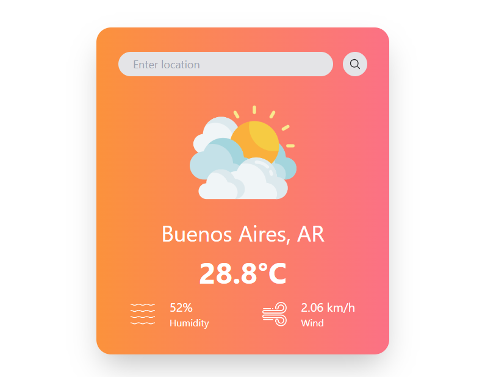

# 🌟 WeatherApp

> Get real time weather information

| Application that allows users to obtain real-time weather information for a specific location via openWeather API.

## Built With

## 📷 Preview

## Live Site

[Live Site Link](https://weatherapptg.netlify.app/)

## Author

- [@mauroTG](https://www.github.com/mauroTG)
